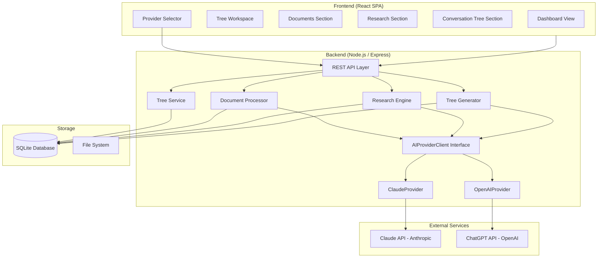

# Design Document: Client Intelligence Tree

## Overview

The Client Intelligence Tree is a full-stack web application that enables agency teams to build structured, AI-powered conversation preparation tools for client engagements. Users create per-client workspaces ("trees"), upload past work products, trigger automated client research via a selectable AI provider, and generate two-level conversation decision trees that combine institutional knowledge with real-time business intelligence.

The system is built as a Node.js/Express backend with a React frontend, using SQLite for persistence and a provider-agnostic AI integration layer supporting both the Anthropic Claude API and the OpenAI ChatGPT API for all AI-powered analysis (document summarization, client research, and tree generation). Users choose which provider to use per operation, and the system records which provider produced each result.

### Key Design Decisions

- **SQLite over Postgres**: This is a single-user or small-team tool. SQLite keeps deployment simple with zero infrastructure overhead while providing full relational capabilities.
- **Server-side document parsing**: PDF, DOCX, PPTX, and XLSX parsing happens on the Node.js backend using established libraries, keeping the client lightweight.
- **Multi-provider AI abstraction**: An `AIProviderClient` interface abstracts over Claude and ChatGPT, with `ClaudeProvider` and `OpenAIProvider` implementations. This allows users to switch providers per operation and provides resilience when one service is unavailable.
- **Provider recorded per result**: The `provider` field on `research_results` and `decision_trees` tables records which AI provider generated each result, enabling traceability and display in the UI.
- **Equivalent prompt structures**: Both providers receive structurally equivalent prompts so output quality and format remain consistent regardless of provider selection.
- **File storage on disk**: Uploaded files are stored on the local filesystem with metadata in SQLite. This avoids cloud storage dependencies for an internal tool.

## Architecture

The application follows a standard three-tier architecture with a provider abstraction layer for AI services:



### Request Flow

1. Frontend makes REST API calls to Express backend, including a `provider` parameter (`'claude'` or `'chatgpt'`) for AI-powered operations
2. Express routes delegate to service modules (TreeService, DocProcessor, ResearchEngine, TreeGenerator)
3. Services resolve the appropriate `AIProviderClient` implementation based on the `provider` parameter
4. The selected provider wraps all API calls to its respective service with retry logic and error handling
5. Results are persisted with the `provider` field recorded in the database
6. Responses flow back through the same layers, including provider attribution

## Components and Interfaces

### Backend Components

#### REST API Layer (`/api`)

| Endpoint | Method | Description |
|---|---|---|
| `/api/trees` | GET | List all trees with summary info |
| `/api/trees` | POST | Create a new tree (body: `{ clientName }`) |
| `/api/trees/:treeId` | GET | Get tree details |
| `/api/trees/:treeId/documents` | GET | List documents for a tree |
| `/api/trees/:treeId/documents` | POST | Upload document(s) (multipart) |
| `/api/trees/:treeId/research` | GET | Get research results for a tree |
| `/api/trees/:treeId/research` | POST | Trigger research (body: `{ provider }`) |
| `/api/trees/:treeId/decision-tree` | GET | Get current decision tree |
| `/api/trees/:treeId/decision-tree` | POST | Generate decision tree (body: `{ provider }`) |
| `/api/trees/:treeId/decision-tree/previous` | GET | Get previously generated decision tree |

The `provider` field in POST request bodies accepts `'claude'` or `'chatgpt'` and defaults to `'claude'` if omitted.

#### Tree Service

Manages CRUD operations for tree workspaces.

```typescript
interface TreeService {
  createTree(clientName: string): Promise<Tree>;
  listTrees(): Promise<TreeSummary[]>;
  getTree(treeId: string): Promise<Tree>;
}
```

#### Document Processor

Handles file upload, parsing, and text extraction.

```typescript
interface DocumentProcessor {
  uploadDocument(treeId: string, file: UploadedFile, metadata: DocumentMetadata): Promise<Document>;
  listDocuments(treeId: string): Promise<Document[]>;
  extractText(filePath: string, fileType: SupportedFileType): Promise<string>;
}
```

Supported file types and their parsing libraries:
- **PDF**: `pdf-parse`
- **DOCX**: `mammoth`
- **PPTX**: Custom XML extraction from the OOXML zip structure
- **XLSX**: `xlsx` (SheetJS)
- **Plain text**: Direct read

#### Research Engine

Orchestrates AI-powered client research using the selected provider.

```typescript
interface ResearchEngine {
  runResearch(treeId: string, clientName: string, provider: AIProvider): Promise<ResearchResult>;
  getResearch(treeId: string): Promise<ResearchResult | null>;
}
```

#### Tree Generator

Combines document insights and research to produce the decision tree using the selected provider.

```typescript
interface TreeGenerator {
  generateTree(treeId: string, provider: AIProvider): Promise<DecisionTree>;
  getPreviousTree(treeId: string): Promise<DecisionTree | null>;
  getCurrentTree(treeId: string): Promise<DecisionTree | null>;
}
```

#### AI Provider Client Interface

Provider-agnostic abstraction for all AI interactions. Both `ClaudeProvider` and `OpenAIProvider` implement this interface.

```typescript
interface AIProviderClient {
  readonly providerName: AIProvider;
  analyzeDocuments(documents: DocumentContent[]): Promise<DocumentInsights>;
  researchClient(clientName: string): Promise<ResearchFindings>;
  generateDecisionTree(insights: DocumentInsights, research: ResearchFindings): Promise<RawDecisionTree>;
}
```

#### ClaudeProvider

Implementation of `AIProviderClient` wrapping the Anthropic SDK.

```typescript
class ClaudeProvider implements AIProviderClient {
  readonly providerName = 'claude';
  constructor(apiKey?: string);
  // ... implements all AIProviderClient methods using Anthropic SDK
}
```

- Uses `claude-sonnet-4-20250514` model
- Retry logic: 3 attempts with exponential backoff (1s, 2s, 4s)
- Respects `Retry-After` header on 429 responses
- Timeout: 120 seconds per request
- Errors wrapped in `AIProviderError` with provider name, status code, and message

#### OpenAIProvider

Implementation of `AIProviderClient` wrapping the OpenAI SDK.

```typescript
class OpenAIProvider implements AIProviderClient {
  readonly providerName = 'chatgpt';
  constructor(apiKey?: string);
  // ... implements all AIProviderClient methods using OpenAI SDK
}
```

- Uses `gpt-4o` model
- Retry logic: 3 attempts with exponential backoff (1s, 2s, 4s)
- Respects `Retry-After` header on 429 responses
- Timeout: 120 seconds per request
- Errors wrapped in `AIProviderError` with provider name, status code, and message

#### Provider Factory

Resolves the correct `AIProviderClient` implementation based on the provider parameter.

```typescript
function getProviderClient(provider: AIProvider): AIProviderClient {
  switch (provider) {
    case 'claude': return new ClaudeProvider();
    case 'chatgpt': return new OpenAIProvider();
  }
}
```

### Frontend Components

#### Dashboard (`/`)
- Displays list of all trees as cards
- Each card shows: client name, document count, research status (none/complete), tree status (none/generated/outdated)
- "Create New Tree" button with client name input

#### Tree Workspace (`/trees/:treeId`)
- Tab-based navigation between Documents, Research, and Conversation Tree sections
- State preserved across tab switches (client-side state management)

#### Documents Section
- File upload dropzone accepting PDF, DOCX, PPTX, XLSX, TXT
- Form fields for project name and document category (brief, schedule, deliverable, other)
- Table of uploaded documents with file name, project name, category, upload date, file type

#### Research Section
- Provider Selector shown before triggering research, defaulting to the most recently used provider for this tree (or Claude if none)
- "Run Research" / "Refresh Research" button
- Research results displayed in categorized cards: Financial Performance, Recent News, New Offerings, Challenges
- Each finding shows source attribution
- Provider name badge displayed alongside research results (e.g., "Researched with Claude")
- Loading state with operation description and provider name during research

#### Conversation Tree Section
- Provider Selector shown before triggering tree generation, defaulting to the most recently used provider for this tree (or Claude if none)
- Visual tree display with expandable Root Nodes
- Each Root Node expands to show Leaf Nodes
- Clicking a node shows rationale panel with referenced Work Products and Research
- "Generate Tree" / "Regenerate Tree" button
- Provider name badge displayed alongside the decision tree (e.g., "Generated with ChatGPT")
- Outdated indicator when documents or research have changed since last generation
- Access to previous tree version

#### Provider Selector Component
- Dropdown or toggle control allowing selection between "Claude" and "ChatGPT"
- Defaults to the most recently used provider for the current tree, or Claude if no prior selection
- Displayed inline before the action button for research and tree generation operations
- Shows the provider name in the loading indicator during AI operations

## Data Models

### Database Schema

```sql
CREATE TABLE trees (
  id TEXT PRIMARY KEY,
  client_name TEXT NOT NULL,
  last_provider TEXT CHECK(last_provider IN ('claude', 'chatgpt')),
  created_at TEXT NOT NULL DEFAULT (datetime('now')),
  updated_at TEXT NOT NULL DEFAULT (datetime('now'))
);

CREATE TABLE documents (
  id TEXT PRIMARY KEY,
  tree_id TEXT NOT NULL REFERENCES trees(id),
  file_name TEXT NOT NULL,
  file_path TEXT NOT NULL,
  file_type TEXT NOT NULL CHECK(file_type IN ('pdf', 'docx', 'pptx', 'xlsx', 'txt')),
  project_name TEXT,
  category TEXT CHECK(category IN ('brief', 'schedule', 'deliverable', 'other')),
  extracted_text TEXT,
  uploaded_at TEXT NOT NULL DEFAULT (datetime('now')),
  FOREIGN KEY (tree_id) REFERENCES trees(id)
);

CREATE TABLE research_results (
  id TEXT PRIMARY KEY,
  tree_id TEXT NOT NULL UNIQUE REFERENCES trees(id),
  provider TEXT NOT NULL CHECK(provider IN ('claude', 'chatgpt')),
  findings_json TEXT NOT NULL,
  completed_at TEXT NOT NULL DEFAULT (datetime('now')),
  FOREIGN KEY (tree_id) REFERENCES trees(id)
);

CREATE TABLE decision_trees (
  id TEXT PRIMARY KEY,
  tree_id TEXT NOT NULL REFERENCES trees(id),
  provider TEXT NOT NULL CHECK(provider IN ('claude', 'chatgpt')),
  tree_json TEXT NOT NULL,
  is_current INTEGER NOT NULL DEFAULT 1,
  generated_at TEXT NOT NULL DEFAULT (datetime('now')),
  FOREIGN KEY (tree_id) REFERENCES trees(id)
);
```

### TypeScript Types

```typescript
type AIProvider = 'claude' | 'chatgpt';
type SupportedFileType = 'pdf' | 'docx' | 'pptx' | 'xlsx' | 'txt';
type DocumentCategory = 'brief' | 'schedule' | 'deliverable' | 'other';
type ResearchStatus = 'none' | 'in_progress' | 'complete' | 'error';
type TreeGenerationStatus = 'none' | 'in_progress' | 'generated' | 'outdated' | 'error';

interface Tree {
  id: string;
  clientName: string;
  lastProvider: AIProvider | null;
  createdAt: string;
  updatedAt: string;
}

interface TreeSummary extends Tree {
  documentCount: number;
  researchStatus: ResearchStatus;
  treeStatus: TreeGenerationStatus;
}

interface Document {
  id: string;
  treeId: string;
  fileName: string;
  filePath: string;
  fileType: SupportedFileType;
  projectName: string | null;
  category: DocumentCategory | null;
  extractedText: string | null;
  uploadedAt: string;
}

interface DocumentMetadata {
  projectName?: string;
  category?: DocumentCategory;
}

interface ResearchFinding {
  category: 'financial_performance' | 'recent_news' | 'new_offerings' | 'challenges';
  title: string;
  summary: string;
  source: string;
}

interface ResearchResult {
  id: string;
  treeId: string;
  provider: AIProvider;
  findings: ResearchFinding[];
  completedAt: string;
}

interface ConversationNode {
  id: string;
  title: string;
  content: string;
  rationale: string;
  sourceDocumentIds: string[];
  sourceResearchCategories: string[];
}

interface RootNode extends ConversationNode {
  leafNodes: LeafNode[];
}

interface LeafNode extends ConversationNode {}

interface DecisionTree {
  id: string;
  treeId: string;
  provider: AIProvider;
  rootNodes: RootNode[];
  isCurrent: boolean;
  generatedAt: string;
}

// AI Provider Client types
interface DocumentContent {
  id: string;
  fileName: string;
  extractedText: string;
}

interface DocumentInsight {
  documentId: string;
  fileName: string;
  keyThemes: string[];
  summary: string;
}

interface DocumentInsights {
  insights: DocumentInsight[];
}

interface ResearchFindings {
  clientName: string;
  findings: ResearchFinding[];
}

interface RawLeafNode {
  id: string;
  title: string;
  content: string;
  rationale: string;
  sourceDocumentIds: string[];
  sourceResearchCategories: string[];
}

interface RawRootNode extends RawLeafNode {
  leafNodes: RawLeafNode[];
}

interface RawDecisionTree {
  rootNodes: RawRootNode[];
}

// Error class for provider errors
class AIProviderError extends Error {
  provider: AIProvider;
  statusCode: number;
  originalMessage: string;
}
```

### Environment Configuration

`.env.example`:
```bash
# AI Provider API Keys
# At least one is required. Both are needed for full multi-provider support.
ANTHROPIC_API_KEY=sk-ant-your-key-here
OPENAI_API_KEY=sk-your-key-here

# Server port (optional, defaults to 3001)
PORT=3001
```

## Correctness Properties

*A property is a characteristic or behavior that should hold true across all valid executions of a system — essentially, a formal statement about what the system should do. Properties serve as the bridge between human-readable specifications and machine-verifiable correctness guarantees.*

### Property 1: Tree creation round-trip

*For any* non-empty, non-whitespace client name string, calling `createTree(clientName)` and then `getTree(id)` should return a tree whose `clientName` matches the original input.

**Validates: Requirements 1.2**

### Property 2: Empty client name rejection

*For any* string composed entirely of whitespace (including the empty string), calling `createTree` should reject the input and not create a tree.

**Validates: Requirements 1.5**

### Property 3: Dashboard lists all trees with required fields

*For any* set of created trees, calling `listTrees()` should return a list containing every created tree, and each entry should include `clientName`, `createdAt`, `documentCount`, `researchStatus`, and `treeStatus`.

**Validates: Requirements 1.3, 6.1**

### Property 4: Supported file types are accepted

*For any* file of a supported type (PDF, DOCX, PPTX, XLSX, TXT), uploading it to a tree should succeed without error.

**Validates: Requirements 2.2**

### Property 5: Document upload preserves metadata and extracts text

*For any* uploaded document with a project name and category, retrieving that document should return the same file name, file type, project name, and category, and the `extractedText` field should be non-null and non-empty.

**Validates: Requirements 2.3, 2.5**

### Property 6: Document list completeness

*For any* set of documents uploaded to a tree, calling `listDocuments(treeId)` should return all uploaded documents, each with `fileName`, `uploadedAt`, and `fileType`.

**Validates: Requirements 2.4**

### Property 7: Unsupported file type rejection

*For any* file with an extension not in the supported set (pdf, docx, pptx, xlsx, txt), uploading should be rejected with an error message that lists the supported formats.

**Validates: Requirements 2.6**

### Property 8: Research results are categorized with sources

*For any* completed research result, the findings should contain entries in the four required categories (financial_performance, recent_news, new_offerings, challenges), and every finding should have a non-empty `source` field.

**Validates: Requirements 3.2, 3.4**

### Property 9: Research refresh replaces previous results

*For any* tree with existing research, triggering a research refresh should replace the previous results such that `getResearch(treeId)` returns findings with a `completedAt` timestamp later than the original.

**Validates: Requirements 3.5**

### Property 10: AI operations record the selected provider

*For any* AI-powered operation (research or tree generation) performed with a specified `AIProvider`, the stored result should have its `provider` field set to the provider that was selected for the operation.

**Validates: Requirements 3.6, 4.7**

### Property 11: Decision tree structural integrity

*For any* generated decision tree, the tree should have at least one root node, each root node should have at least one leaf node, and every node (root and leaf) should have non-empty `title`, `content`, and `rationale` fields.

**Validates: Requirements 4.2, 4.4**

### Property 12: Node rationale references sources

*For any* conversation node in a generated decision tree, the `sourceDocumentIds` array should contain at least one valid document ID and/or the `sourceResearchCategories` array should contain at least one valid research category.

**Validates: Requirements 4.6**

### Property 13: Outdated indicator after changes

*For any* tree with a generated decision tree, uploading a new document or refreshing research should cause the tree's `treeStatus` to become `outdated`.

**Validates: Requirements 5.1**

### Property 14: Regeneration produces new tree and retains previous

*For any* tree with an existing decision tree, regenerating should produce a new decision tree marked as `isCurrent: true`, the previous tree should be marked `isCurrent: false`, and calling `getPreviousTree(treeId)` should return the old tree.

**Validates: Requirements 5.2, 5.3**

### Property 15: Provider factory resolves valid implementations

*For any* valid `AIProvider` value (`'claude'` or `'chatgpt'`), calling `getProviderClient(provider)` should return an `AIProviderClient` whose `providerName` matches the requested provider.

**Validates: Requirements 7.1**

### Property 16: Provider selector defaults to last used provider

*For any* tree with a recorded `lastProvider`, the default provider for the next AI operation should equal `lastProvider`. For any tree with no `lastProvider` (null), the default should be `'claude'`.

**Validates: Requirements 7.2, 7.8**

### Property 17: Provider errors identify the failing provider

*For any* `AIProviderError`, the error should contain the `provider` field identifying which provider failed, a numeric `statusCode`, and a human-readable `originalMessage`.

**Validates: Requirements 7.5**

### Property 18: AI prompts include all source material

*For any* set of documents and research associated with a tree, the prompt sent to the AI provider for tree generation should reference content from every uploaded document and include the research findings.

**Validates: Requirements 7.6**

### Property 19: Equivalent prompt structures across providers

*For any* given set of document insights and research findings, the prompts constructed for Claude and ChatGPT should be structurally equivalent — containing the same system instructions, the same user content, and requesting the same JSON output schema.

**Validates: Requirements 7.7**

## Error Handling

### API Error Responses

All API endpoints return errors in a consistent format:

```json
{
  "error": {
    "code": "VALIDATION_ERROR",
    "message": "Human-readable description of the error",
    "provider": "claude"
  }
}
```

The `provider` field is included only for AI-provider-related errors.

Error codes and HTTP status mapping:

| Code | HTTP Status | Description |
|---|---|---|
| `VALIDATION_ERROR` | 400 | Invalid input (empty client name, unsupported file type, invalid provider) |
| `NOT_FOUND` | 404 | Tree, document, or resource not found |
| `PRECONDITION_FAILED` | 412 | Missing prerequisites (no documents for tree generation, no research) |
| `EXTRACTION_FAILED` | 422 | Document text extraction failed |
| `AI_PROVIDER_ERROR` | 502 | Selected AI provider API returned an error |
| `AI_PROVIDER_UNAVAILABLE` | 503 | Selected AI provider API is unreachable |
| `INTERNAL_ERROR` | 500 | Unexpected server error |

### Error Handling Strategy by Component

**Document Processor:**
- Validates file extension before processing; rejects unsupported types with `VALIDATION_ERROR`
- Wraps text extraction in try/catch; returns `EXTRACTION_FAILED` with suggestion to re-upload
- Limits file size (configurable, default 10MB); rejects oversized files with `VALIDATION_ERROR`

**Research Engine:**
- Validates the `provider` parameter; rejects invalid values with `VALIDATION_ERROR`
- Catches AI provider errors and returns `AI_PROVIDER_ERROR` with the provider name and original error context
- On provider failure, the error response includes a suggestion to retry with the other provider (e.g., "Claude is unavailable. You can retry with ChatGPT.")
- Detects insufficient research results and returns a specific message suggesting the user verify the client name
- Implements retry with exponential backoff (3 attempts) before surfacing errors

**Tree Generator:**
- Validates preconditions (documents exist, research complete) before calling the AI provider; returns `PRECONDITION_FAILED` with specific missing prerequisite
- Validates the `provider` parameter; rejects invalid values with `VALIDATION_ERROR`
- Catches AI provider errors with retry logic matching Research Engine
- On provider failure, suggests switching to the other provider
- Validates the structure of the AI provider's response (must have root nodes with leaf nodes); falls back to `INTERNAL_ERROR` if response is malformed

**AI Provider Client (both implementations):**
- Centralizes retry logic: 3 attempts with exponential backoff (1s, 2s, 4s)
- Handles rate limiting (429) with respect to `Retry-After` header
- Timeout: 120 seconds per request (document analysis and research can be lengthy)
- All errors are wrapped in `AIProviderError` with the provider name, original status code, and message
- `ClaudeProvider` wraps Anthropic SDK errors; `OpenAIProvider` wraps OpenAI SDK errors

### Frontend Error Handling

- All API errors display a toast notification with the error message
- AI-provider-related errors (502, 503) show the failing provider name and offer two actions: "Retry" and "Switch to [other provider]"
- Validation errors highlight the relevant form field
- Network errors show a generic "Connection lost" message with retry

## Testing Strategy

### Unit Tests

Unit tests cover specific examples, edge cases, and integration points:

- **Tree Service**: Create tree with valid name, reject empty/whitespace names, list returns correct summaries with `lastProvider`
- **Document Processor**: Parse each supported file type with a known test file, reject unsupported types, handle extraction failures gracefully
- **Research Engine**: Verify research result structure, verify provider parameter is passed through and recorded, handle AI provider errors, handle insufficient results
- **Tree Generator**: Verify precondition checks (no docs, no research), verify output structure, verify provider parameter is passed through and recorded, handle AI provider errors
- **ClaudeProvider**: Verify retry logic, timeout handling, rate limit respect, error wrapping in `AIProviderError` with `provider: 'claude'`
- **OpenAIProvider**: Verify retry logic, timeout handling, rate limit respect, error wrapping in `AIProviderError` with `provider: 'chatgpt'`
- **Provider Factory**: Verify `getProviderClient('claude')` returns `ClaudeProvider`, `getProviderClient('chatgpt')` returns `OpenAIProvider`
- **API Routes**: HTTP status codes for success and error cases, request validation including `provider` parameter validation, provider-specific error responses with switch suggestion

### Property-Based Tests

Property-based tests validate universal properties using **fast-check** (JavaScript/TypeScript PBT library). Each property test runs a minimum of 100 iterations.

Each property test is tagged with a comment referencing the design property:

```typescript
// Feature: client-intelligence-tree, Property 1: Tree creation round-trip
```

Properties to implement as property-based tests:

1. **Property 1**: Generate random non-whitespace strings → createTree → getTree → verify clientName matches
2. **Property 2**: Generate random whitespace-only strings → createTree → verify rejection
3. **Property 3**: Generate random sets of trees → create all → listTrees → verify all present with required fields
4. **Property 4**: Generate random files of each supported type → upload → verify success
5. **Property 5**: Generate random documents with metadata → upload → retrieve → verify all fields preserved and extractedText non-null
6. **Property 6**: Generate random document sets → upload all → listDocuments → verify completeness
7. **Property 7**: Generate random unsupported file extensions → upload → verify rejection with supported formats in error
8. **Property 8**: Generate random research results → verify category coverage and source attribution
9. **Property 9**: Generate trees with research → refresh → verify new timestamp
10. **Property 10**: Generate random AI operations with random provider selection → verify stored result records the selected provider
11. **Property 11**: Generate decision trees → verify structural integrity (root nodes, leaf nodes, non-empty fields)
12. **Property 12**: Generate decision tree nodes → verify source references are non-empty
13. **Property 13**: Generate trees with decision trees → upload doc or refresh research → verify outdated status
14. **Property 14**: Generate trees → generate tree → regenerate → verify current/previous state
15. **Property 15**: Generate random valid AIProvider values → getProviderClient → verify providerName matches
16. **Property 16**: Generate trees with random lastProvider values (including null) → verify default provider is lastProvider or 'claude' when null
17. **Property 17**: Generate random AIProviderError instances → verify provider, statusCode, and originalMessage are present
18. **Property 18**: Generate random document sets and research → verify AI prompt includes all content
19. **Property 19**: Generate random document insights and research findings → construct prompts for both providers → verify structural equivalence

### Test Configuration

- **Framework**: Vitest for unit tests and property-based tests
- **PBT Library**: fast-check
- **Minimum iterations**: 100 per property test
- **AI Providers**: Both Claude and OpenAI APIs mocked in all tests using stubs that return structured responses
- **Database**: In-memory SQLite instance per test suite for isolation
- **File system**: Temporary directories for upload tests, cleaned up after each suite
- **Provider coverage**: Tests that involve AI operations should be parameterized to run against both provider implementations where applicable
