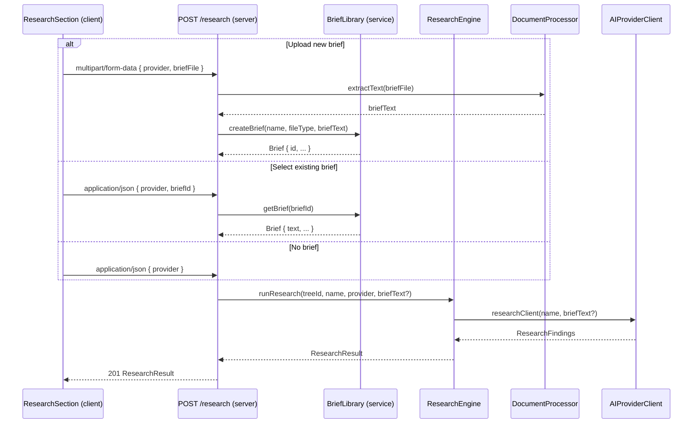
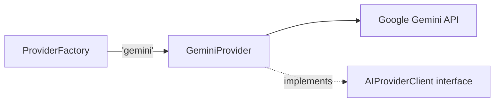
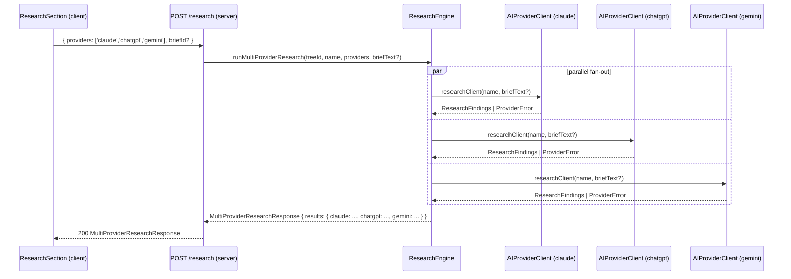

# Design Document: Research Brief, Gemini Provider, Case Study Category, Tree Types, Brief Library, Navigation & Multi-Provider Research

## Overview

This document covers the technical design for the following enhancements:

1. **Research Brief Upload** — Users can supply a brief (from the library or a new upload) that replaces the default research criteria when running research.
2. **Gemini AI Provider** — Google Gemini is added as a third AI provider alongside Claude and ChatGPT.
3. **Case Study Document Category** — `'case_study'` is added as a valid document category.
4. **Client vs Subject Tree Types** — Trees are classified as `'client'` or `'subject'` at creation time, with a badge displayed on each Tree_Card.
5. **Research Brief Library** — Briefs are persisted in SQLite and managed via CRUD API endpoints.
6. **Main Navigation** — A persistent top-level nav with Trees, Research Briefs, and Settings sections.
7. **Default AI Engine Setting** — Users can configure a default AI provider stored in the database.
8. **Multi-Provider Research Selection** — Users can select one or more providers via checkboxes; the server fans out the research call to each selected provider in parallel and returns per-provider results; the UI displays each provider's output in a separate labeled section.

---

## Architecture

### High-Level Flow — Research Brief (with library)



### High-Level Flow — Gemini Provider



### Navigation Structure

```
Application
├── Navigation_Menu (persistent)
│   ├── Trees  →  Workspace (Tree_Cards)
│   ├── Research Briefs  →  Brief_Management_Console
│   └── Settings  →  Settings_Page
```

### High-Level Flow — Multi-Provider Research



---

## Database Schema Changes

### New table: `briefs`

```sql
CREATE TABLE briefs (
  id        TEXT PRIMARY KEY,
  name      TEXT NOT NULL,
  file_type TEXT NOT NULL,  -- 'pdf' | 'docx' | 'txt'
  text      TEXT NOT NULL,
  created_at TEXT NOT NULL DEFAULT (datetime('now'))
);
```

### Modified table: `trees`

Add a `tree_type` column:

```sql
ALTER TABLE trees ADD COLUMN tree_type TEXT NOT NULL DEFAULT 'client';
-- CHECK constraint: tree_type IN ('client', 'subject')
```

### New table: `settings`

```sql
CREATE TABLE settings (
  key   TEXT PRIMARY KEY,
  value TEXT NOT NULL
);
-- Row: ('default_provider', 'claude')
```

---

## Components and Interfaces

### 1. Type Definitions (shared)

Both `server/src/types.ts` and `client/src/types.ts` require these additions:

```typescript
export type AIProvider = 'claude' | 'chatgpt' | 'gemini';
export type DocumentCategory = 'brief' | 'schedule' | 'deliverable' | 'case_study' | 'other';
export type TreeType = 'client' | 'subject';

export interface Tree {
  // existing fields ...
  treeType: TreeType;  // new
}

export interface Brief {
  id: string;
  name: string;
  fileType: 'pdf' | 'docx' | 'txt';
  createdAt: string;
  // text is server-only; not sent to client in list responses
}

export interface BriefDetail extends Brief {
  text: string;  // included when fetching a single brief for research use
}

// Multi-provider research types
export interface ProviderResearchResult {
  provider: AIProvider;
  findings?: ResearchFindings;   // present on success
  error?: string;                // present on per-provider failure
}

export interface MultiProviderResearchResponse {
  results: Record<AIProvider, ProviderResearchResult>;
}
```

The `AIProviderClient` interface gains an optional `briefText` parameter on `researchClient`:

```typescript
export interface AIProviderClient {
  readonly providerName: AIProvider;
  analyzeDocuments(documents: DocumentContent[]): Promise<DocumentInsights>;
  researchClient(name: string, briefText?: string): Promise<ResearchFindings>;
  generateDecisionTree(insights: DocumentInsights, research: ResearchFindings): Promise<RawDecisionTree>;
}
```

The research request body type is updated to accept an array of providers:

```typescript
// Previously: { provider: AIProvider; briefId?: string }
export interface ResearchRequestBody {
  providers: AIProvider[];   // one or more; replaces the single `provider` field
  briefId?: string;
}
```

### 2. GeminiProvider (`server/src/services/geminiProvider.ts`)

New file mirroring the structure of `claudeProvider.ts` and `openaiProvider.ts`.

- Uses `@google/generative-ai` npm package.
- Model: `gemini-1.5-pro` (configurable via constant).
- Reads `GEMINI_API_KEY` from `process.env` on construction; throws a descriptive `AppError` if absent.
- Implements the same `withRetry` pattern, mapping Google SDK errors to `AIProviderError('gemini', ...)`.
- Reuses the same system prompt strings (exported constants) as the other providers.

```typescript
export class GeminiProvider implements AIProviderClient {
  readonly providerName = 'gemini' as const;
  private client: GoogleGenerativeAI;
  private model: GenerativeModel;

  constructor(apiKey?: string) {
    const key = apiKey ?? process.env.GEMINI_API_KEY;
    if (!key) throw new AppError('VALIDATION_ERROR', 'GEMINI_API_KEY is not configured');
    this.client = new GoogleGenerativeAI(key);
    this.model = this.client.getGenerativeModel({ model: MODEL });
  }
  // analyzeDocuments, researchClient, generateDecisionTree ...
}
```

The Gemini SDK uses `model.generateContent(prompt)`. The provider uses the `systemInstruction` field in the model config for system prompts rather than concatenation.

### 3. ProviderFactory (`server/src/services/providerFactory.ts`)

Add the `'gemini'` case:

```typescript
case 'gemini':
  return new GeminiProvider();
```

### 4. ResearchEngine (`server/src/services/researchEngine.ts`)

`runResearch` gains an optional `briefText` parameter forwarded to `researchClient`:

```typescript
async runResearch(
  treeId: string,
  name: string,
  provider: AIProvider,
  briefText?: string
): Promise<ResearchResult>
```

A new `runMultiProviderResearch` method fans out to all selected providers in parallel using `Promise.allSettled`, so a single provider failure does not abort the others:

```typescript
async runMultiProviderResearch(
  treeId: string,
  name: string,
  providers: AIProvider[],
  briefText?: string
): Promise<MultiProviderResearchResponse> {
  const entries = await Promise.allSettled(
    providers.map(p => this.runResearch(treeId, name, p, briefText))
  );
  const results = Object.fromEntries(
    providers.map((p, i) => {
      const settled = entries[i];
      return [p, settled.status === 'fulfilled'
        ? { provider: p, findings: settled.value.findings }
        : { provider: p, error: settled.reason?.message ?? 'Unknown error' }
      ];
    })
  ) as Record<AIProvider, ProviderResearchResult>;
  return { results };
}
```

### 5. BriefService (`server/src/services/briefService.ts`)

New service encapsulating all Brief_Library operations:

```typescript
class BriefService {
  listBriefs(): Promise<Brief[]>
  getBrief(id: string): Promise<BriefDetail>
  createBrief(name: string, fileType: string, text: string): Promise<Brief>
  updateBrief(id: string, fileType: string, text: string): Promise<Brief>
  deleteBrief(id: string): Promise<void>
}
```

### 6. Brief Routes (`server/src/routes/briefs.ts`)

New router mounted at `/api/briefs`:

| Method | Path | Description |
|---|---|---|
| GET | `/api/briefs` | List all briefs |
| GET | `/api/briefs/:id` | Get brief detail (includes text) |
| POST | `/api/briefs` | Create brief (multipart: name + file) |
| PUT | `/api/briefs/:id` | Update brief content (multipart: file) |
| DELETE | `/api/briefs/:id` | Delete brief |

### 7. Research Route (`server/src/routes/research.ts`)

The `POST /` handler accepts either:
- `multipart/form-data` with `providers` (JSON-encoded array), optional `briefFile`, and optional `briefName` (for new upload + save)
- `application/json` with `providers` (array) and optional `briefId` (for selecting an existing brief)

Validation: `providers` must be a non-empty array of valid `AIProvider` values; returns HTTP 400 otherwise.

When `briefFile` is present: extract text via `DocumentProcessor.extractTextFromBuffer`, save to Brief_Library, use text for research.
When `briefId` is present: fetch text from `BriefService.getBrief(briefId)`, use for research.

Pass `providers` array and `briefText` to `ResearchEngine.runMultiProviderResearch`. Return the `MultiProviderResearchResponse` as HTTP 200.

`VALID_PROVIDERS` is updated to include `'gemini'`.

### 8. SettingsService (`server/src/services/settingsService.ts`)

New service for key/value settings:

```typescript
class SettingsService {
  getSetting(key: string): Promise<string | null>
  setSetting(key: string, value: string): Promise<void>
}
```

### 9. Settings Routes (`server/src/routes/settings.ts`)

| Method | Path | Description |
|---|---|---|
| GET | `/api/settings/default-provider` | Get default provider |
| PUT | `/api/settings/default-provider` | Set default provider |

### 10. TreeService (`server/src/services/treeService.ts`)

`createTree` gains a required `treeType: TreeType` parameter. The `tree_type` column is written on insert and returned in all tree queries.

### 11. Client API (`client/src/api.ts`)

New and updated functions:

```typescript
// Updated — providers is now an array
runResearch(treeId: string, providers: AIProvider[], briefFile?: File, briefId?: string): Promise<MultiProviderResearchResponse>
createTree(name: string, treeType: TreeType): Promise<Tree>

// New
listBriefs(): Promise<Brief[]>
createBrief(name: string, file: File): Promise<Brief>
updateBrief(id: string, file: File): Promise<Brief>
deleteBrief(id: string): Promise<void>
getDefaultProvider(): Promise<AIProvider>
setDefaultProvider(provider: AIProvider): Promise<void>
```

### 12. Navigation_Menu (`client/src/components/NavigationMenu.tsx`)

New component rendered at the application root level (in `App.tsx` or `Workspace.tsx`). Maintains `activeSection: 'trees' | 'briefs' | 'settings'` state. Renders the appropriate section component based on active selection. Highlights the active nav item.

### 13. ResearchSection (`client/src/components/ResearchSection.tsx`)

Updated state:

| State | Type | Purpose |
|---|---|---|
| `briefMode` | `'none' \| 'library' \| 'upload'` | Which brief option is selected |
| `selectedBriefId` | `string \| null` | ID of brief chosen from library |
| `briefFile` | `File \| null` | New file to upload |
| `briefFileError` | `string \| null` | Validation error for brief file |
| `libraryBriefs` | `Brief[]` | Briefs fetched from the library |
| `selectedProviders` | `AIProvider[]` | Providers checked in the Multi_Provider_Selector |
| `providerSelectionError` | `string \| null` | Shown when user submits with no providers checked |

On mount (or when `briefMode` switches to `'library'`), fetch briefs via `listBriefs()`. When `briefMode` is `'upload'` and research runs, save the file to the library first, then use the returned brief ID. `providerDisplayName` updated to include `'gemini'` → `'Gemini'`.

On mount, load Default_Provider from `getDefaultProvider()` and initialise `selectedProviders` to `[defaultProvider]`.

The submit handler validates `selectedProviders.length > 0` before calling `runResearch`; if empty, sets `providerSelectionError`.

The response from `runResearch` is now a `MultiProviderResearchResponse`; the component passes it to `Research_Results_Display`.

### 14. Research_Results_Display (`client/src/components/ResearchResultsDisplay.tsx`)

New (or updated) component that receives a `MultiProviderResearchResponse` and renders:
- If `results` contains exactly one provider: renders that provider's result directly (no tabs), preserving the existing single-provider UX.
- If `results` contains multiple providers: renders a tab strip or accordion with one tab/section per provider, labeled by provider name. Each section shows the provider's findings or its error message.

### 15. ConversationTreeSection (`client/src/components/ConversationTreeSection.tsx`)

Updated to accept either a single tree or a map of per-provider trees. When multiple provider trees are present, renders a tab strip labeled by provider name so the user can compare outputs. When only one provider tree is present, renders as before without tabs.

### 16. BriefManagementConsole (`client/src/components/BriefManagementConsole.tsx`)

New component displayed when the "Research Briefs" nav item is active. Shows a table of briefs with name and date. Provides upload (create), replace (update), and delete actions per row.

### 17. SettingsPage (`client/src/components/SettingsPage.tsx`)

New component displayed when the "Settings" nav item is active. Renders a provider selector for Default_Provider. Loads current setting on mount; saves on change.

### 18. Dashboard / Workspace (`client/src/components/Dashboard.tsx` or `Workspace.tsx`)

Tree creation flow updated to include a Tree_Type selector (radio: "Client" / "Subject"). Tree_Cards updated to display a badge (`CLIENT` or `SUBJECT`) using the `treeType` field.

### 19. Multi_Provider_Selector (`client/src/components/MultiProviderSelector.tsx`)

New component replacing the existing `ProviderSelector` in the ResearchSection. Renders a checkbox for each available provider (Claude, ChatGPT, Gemini). Accepts `selectedProviders: AIProvider[]` and `onChange: (providers: AIProvider[]) => void` props. The Default_Provider checkbox is pre-checked on mount.

### 20. ProviderSelector (`client/src/components/ProviderSelector.tsx`)

Retained for use in the SettingsPage (single-select for default provider). Add `<option value="gemini">Gemini</option>`.

### 21. DocumentsSection (`client/src/components/DocumentsSection.tsx`)

Add `<option value="case_study">Case Study</option>` and update the category label map.

### 22. DocumentProcessor (`server/src/services/documentProcessor.ts`)

Add `extractTextFromBuffer(buffer: Buffer, fileType: SupportedFileType): Promise<string>` and add `'case_study'` to `VALID_CATEGORIES`.

---

## Data Models

### Brief persistence flow

1. User uploads a file (via Brief_Management_Console or ResearchSection).
2. Server receives multipart upload; `DocumentProcessor.extractTextFromBuffer` extracts text.
3. `BriefService.createBrief` inserts a row into the `briefs` table with a generated UUID.
4. The `Brief` record (without text) is returned to the client.
5. During research, the server fetches the brief text from the database by ID and passes it to `ResearchEngine`.

### Tree type flow

1. Client sends `treeType` in the create-tree request body.
2. `TreeService.createTree` writes `tree_type` to the `trees` table.
3. All tree list/get responses include `treeType`.
4. The client renders a badge on each Tree_Card based on `treeType`.

### Settings flow

1. On app load, client fetches `GET /api/settings/default-provider`.
2. The returned value pre-populates the Provider_Selector.
3. On Settings_Page save, client calls `PUT /api/settings/default-provider`.

---

## Correctness Properties

### Property 1: Brief file type validation rejects non-PDF/DOCX/TXT files
*For any* file whose extension is not in `{pdf, docx, txt}`, selecting it as a research brief should result in a visible error and no brief being set in state.
**Validates: Requirements 1.4**

### Property 2: Valid brief file name is displayed
*For any* valid brief file (PDF, DOCX, or TXT), after selection the ResearchSection should display that file's name.
**Validates: Requirements 1.5**

### Property 3: Brief upload control visibility matches briefMode state
*For any* value of `briefMode`, the file upload control should be visible if and only if `briefMode === 'upload'`.
**Validates: Requirements 1.2, 1.3**

### Property 4: Switching to standard criteria clears the brief selection
*For any* ResearchSection state where a brief is selected or uploaded, switching `briefMode` to `'none'` should clear `briefFile`, `selectedBriefId`, and `briefFileError`.
**Validates: Requirements 1.7**

### Property 5: Research request with brief transmits the brief reference
*For any* valid brief (file or ID), calling `runResearch` should produce a request that includes the brief reference.
**Validates: Requirements 1.6**

### Property 6: Brief text is extracted and forwarded to the AI provider
*For any* research request that includes a brief, `ResearchEngine.runResearch` should pass the brief text as `briefText` to the provider's `researchClient` method.
**Validates: Requirements 2.1, 2.3**

### Property 7: Research without brief uses standard criteria (no briefText)
*For any* research request that does not include a brief, the provider's `researchClient` should be called with `briefText` as `undefined`.
**Validates: Requirements 2.2**

### Property 8: Brief text appears in the AI prompt in place of standard criteria
*For any* non-empty `briefText`, the prompt string constructed by the provider's `researchClient` should contain the `briefText` and should not contain the standard research criteria boilerplate.
**Validates: Requirements 2.6**

### Property 9: extractTextFromBuffer succeeds for all supported brief formats
*For any* valid buffer of type `pdf`, `docx`, or `txt`, `extractTextFromBuffer` should return a non-empty string without throwing.
**Validates: Requirements 2.5**

### Property 10: Gemini API errors are wrapped as AIProviderError with provider 'gemini'
*For any* error thrown by the Google Generative AI SDK, the GeminiProvider should catch it and throw an `AIProviderError` whose `provider` field is `'gemini'`.
**Validates: Requirements 3.7**

### Property 11: Status labels display the correct provider name
*For any* `AIProvider` value (including `'gemini'`), the loading and completion status labels in ResearchSection should display the human-readable name corresponding to that provider.
**Validates: Requirements 4.3**

### Property 12: Provider errors for Gemini trigger the same error UI as other providers
*For any* `AIProviderError` with `provider === 'gemini'`, the application should display the provider error toast with retry and switch-provider options.
**Validates: Requirements 4.4**

### Property 13: Documents uploaded with category 'case_study' are stored with that category
*For any* document upload where the user selects "Case Study", the stored document should have `category === 'case_study'`.
**Validates: Requirements 5.2**

### Property 14: Documents with category 'case_study' render the label "Case Study"
*For any* document whose `category` is `'case_study'`, the rendered category cell should display `"Case Study"`.
**Validates: Requirements 5.4**

### Property 15: Tree creation always stores the specified tree type
*For any* `TreeType` value (`'client'` or `'subject'`), creating a tree with that type should result in the stored tree having `treeType` equal to the specified value.
**Validates: Requirements 6.2**

### Property 16: Tree_Card badge matches the stored tree type
*For any* tree with a given `treeType`, the badge rendered on its Tree_Card should display the label corresponding to that type.
**Validates: Requirements 6.3**

### Property 17: Brief create/read round-trip preserves text content
*For any* valid brief text, creating a brief and then retrieving it by ID should return a brief whose `text` equals the original extracted text.
**Validates: Requirements 7.1, 7.2**

### Property 18: Brief update replaces content while preserving identity
*For any* existing brief, updating it with new content should result in the same brief ID returning the new text.
**Validates: Requirements 7.3**

### Property 19: Default provider setting round-trip
*For any* valid `AIProvider` value, setting it as the default and then reading the default should return the same value.
**Validates: Requirements 10.1, 10.2**

### Property 20: Provider_Selector pre-selects the configured default provider
*For any* configured Default_Provider, opening the ResearchSection should show that provider as the selected value in the Provider_Selector.
**Validates: Requirements 10.3**

### Property 21: Multi_Provider_Selector pre-checks the default provider on mount
*For any* configured Default_Provider, the Multi_Provider_Selector should render that provider's checkbox as checked when the ResearchSection first mounts.
**Validates: Requirements 11.2**

### Property 22: Submitting with no providers selected shows a validation error
*For any* ResearchSection state where `selectedProviders` is empty, attempting to run research should set `providerSelectionError` to a non-empty string and should not call `runResearch`.
**Validates: Requirements 11.4**

### Property 23: Multi-provider response contains one result per requested provider
*For any* non-empty array of valid providers, `runMultiProviderResearch` should return a `MultiProviderResearchResponse` whose `results` map contains exactly one entry per requested provider.
**Validates: Requirements 11.6, 11.7**

### Property 24: A single failing provider does not suppress other providers' results
*For any* multi-provider request where exactly one provider throws, the response should contain an error entry for that provider and successful findings entries for all other providers.
**Validates: Requirements 11.8**

### Property 25: Research_Results_Display renders one section per provider
*For any* `MultiProviderResearchResponse` with N providers, the rendered output should contain exactly N labeled sections (or tabs), one per provider.
**Validates: Requirements 11.9**

### Property 26: Single-provider response renders without tabs
*For any* `MultiProviderResearchResponse` with exactly one provider, the Research_Results_Display should render the result without a tab strip.
**Validates: Requirements 11.11**

---

## Error Handling

### Research Brief Extraction Failure
If `extractTextFromBuffer` throws, the route returns HTTP 422 `EXTRACTION_FAILED`.

### Brief Not Found
If `BriefService.getBrief` is called with a non-existent ID, it throws `AppError('NOT_FOUND', ...)` which the global handler maps to HTTP 404.

### Gemini API Errors

| SDK error type | AIProviderError status | Retry? |
|---|---|---|
| Rate limit / 429 | 429 | Yes, with backoff |
| 5xx | 500 | Yes, with backoff |
| 4xx non-429 | 4xx | No |
| Network error | 503 | Yes, with backoff |

### Missing GEMINI_API_KEY
`GeminiProvider` constructor throws `AppError('VALIDATION_ERROR', 'GEMINI_API_KEY is not configured')` → HTTP 400.

### Invalid Tree Type
If `treeType` is not `'client'` or `'subject'`, the create-tree route returns HTTP 400 `VALIDATION_ERROR`.

### Invalid Default Provider
If the value passed to `PUT /api/settings/default-provider` is not a valid `AIProvider`, the route returns HTTP 400 `VALIDATION_ERROR`.

### Empty Providers Array
If the `providers` field in a research request is missing or an empty array, the research route returns HTTP 400 `VALIDATION_ERROR`.

### Partial Multi-Provider Failure
If one or more (but not all) providers fail during `runMultiProviderResearch`, the server returns HTTP 200 with the `MultiProviderResearchResponse` containing error entries for the failed providers and findings entries for the successful ones. The client displays the error inline within that provider's section.

---

## Testing Strategy

### Unit Tests

- `GeminiProvider` constructor throws when `GEMINI_API_KEY` is absent.
- `ProviderFactory.getProviderClient('gemini')` returns a `GeminiProvider` instance.
- `DocumentProcessor.extractTextFromBuffer` returns text for minimal valid PDF, DOCX, and TXT buffers.
- `ResearchEngine.runResearch` with `briefText` calls `researchClient` with that text.
- `ResearchEngine.runResearch` without `briefText` calls `researchClient` with `undefined`.
- Research route rejects a brief file with an unsupported extension with HTTP 400.
- `BriefService.createBrief` inserts a row and returns a Brief with a generated ID.
- `BriefService.getBrief` returns the stored text.
- `BriefService.updateBrief` replaces text while keeping the same ID.
- `BriefService.deleteBrief` removes the row.
- `TreeService.createTree` stores the `treeType` and returns it.
- `SettingsService.setSetting` / `getSetting` round-trip.
- `DocumentProcessor.uploadDocument` accepts `'case_study'` as a valid category.
- `ProviderSelector` renders a "Gemini" option.
- `DocumentsSection` renders a "Case Study" option and displays the label correctly.
- Tree creation UI requires tree type selection.
- Tree_Card renders the correct badge for each tree type.
- `BriefManagementConsole` lists briefs and supports create/update/delete actions.
- `SettingsPage` loads and saves the default provider.
- `MultiProviderSelector` renders a checkbox for each available provider.
- `MultiProviderSelector` pre-checks the default provider on mount.
- `ResearchSection` shows a validation error when no providers are checked and research is submitted.
- `ResearchEngine.runMultiProviderResearch` with two providers returns results for both.
- `ResearchEngine.runMultiProviderResearch` when one provider throws still returns results for the other.
- Research route rejects a request with an empty `providers` array with HTTP 400.
- `Research_Results_Display` renders one section per provider for a multi-provider response.
- `Research_Results_Display` renders without tabs for a single-provider response.

### Property-Based Tests

Uses **fast-check**. Each property test runs a minimum of 100 iterations.

| Property | Test description |
|---|---|
| P1 | Random non-{pdf,docx,txt} extensions → ResearchSection shows error, no brief set |
| P2 | Random valid file names → ResearchSection displays file name after selection |
| P3 | Random `briefMode` values → upload control visible iff `briefMode === 'upload'` |
| P4 | Any brief selected then `briefMode` → `'none'` → all brief state cleared |
| P5 | Random valid brief references → runResearch sends brief reference in request |
| P6 | Random brief buffers → ResearchEngine passes extracted text to provider |
| P7 | Random requests without brief → provider receives `briefText=undefined` |
| P8 | Random briefText strings → provider prompt contains briefText, not standard criteria |
| P9 | Random valid buffers for {pdf, docx, txt} → extractTextFromBuffer returns non-empty string |
| P10 | Random SDK error types → GeminiProvider throws AIProviderError with provider='gemini' |
| P11 | Random AIProvider values → status label displays correct human-readable name |
| P12 | Random AIProviderError with provider='gemini' → error UI appears with retry/switch options |
| P13 | Random uploads with category='case_study' → stored document has category='case_study' |
| P14 | Random documents with category='case_study' → rendered label is "Case Study" |
| P15 | Random TreeType values → createTree stores and returns the same treeType |
| P16 | Random trees with treeType → Tree_Card badge matches treeType |
| P17 | Random brief text → create then retrieve returns same text (round-trip) |
| P18 | Random brief update → same ID returns new text |
| P19 | Random AIProvider values → set default then get default returns same value |
| P20 | Any configured default provider → ResearchSection Provider_Selector pre-selects it |
| P21 | Any configured default provider → Multi_Provider_Selector pre-checks it on mount |
| P22 | Empty selectedProviders → providerSelectionError set, runResearch not called |
| P23 | Random non-empty provider arrays → runMultiProviderResearch returns one result per provider |
| P24 | One provider throws → response has error for that provider, findings for others |
| P25 | MultiProviderResearchResponse with N providers → Research_Results_Display renders N sections |
| P26 | MultiProviderResearchResponse with 1 provider → rendered without tab strip |

### Integration Tests

- End-to-end: POST `/api/briefs` with a TXT file → GET `/api/briefs/:id` returns matching text.
- End-to-end: POST `/api/trees/:id/research` with `briefId` and `providers: ['claude']` → response contains `MultiProviderResearchResponse` with a `claude` entry.
- End-to-end: POST `/api/trees/:id/research` with `providers: ['claude', 'chatgpt']` → response contains entries for both providers.
- End-to-end: POST `/api/trees` with `treeType: 'subject'` → GET `/api/trees/:id` returns `treeType: 'subject'`.
- End-to-end: PUT `/api/settings/default-provider` → GET `/api/settings/default-provider` returns same value.
